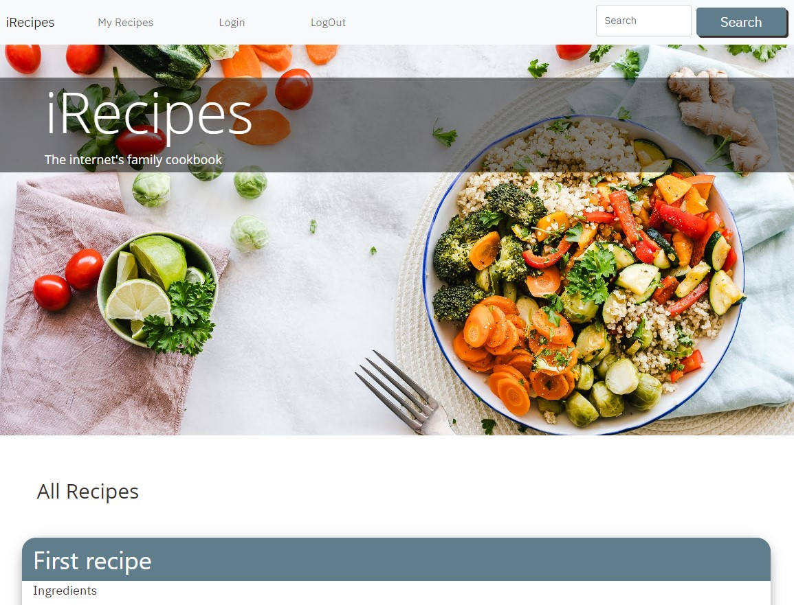
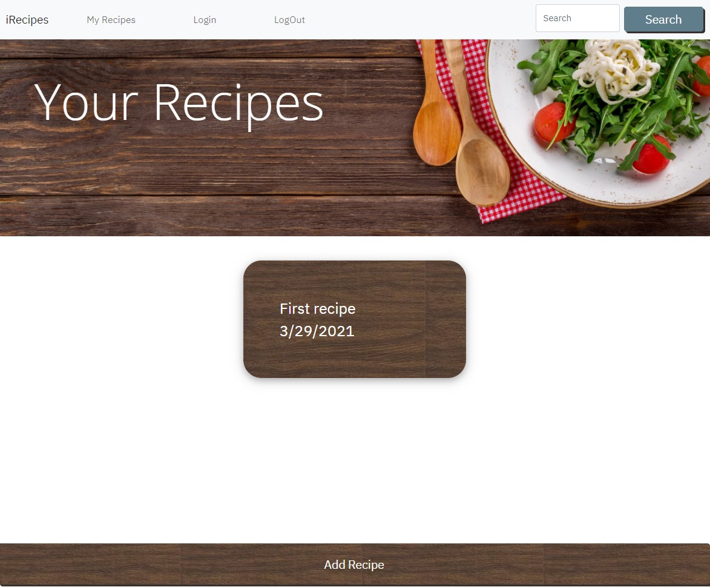

# Project 2 - iRecipes

## Description

iRecipes is a full stack express application that creates an online repository of recipe cards to be stored by users and shared with the world! Users can create and manage their recipe collection, view others, leave comments, and (maybe someday) even more!

## Installation

* Navigate to https://github.com/mpkahn/irecipes and clone repository to local machine.

* To run locally: 
* Install npm (`npm i`). 
* Install any other necessary modules
* Ensure correct information in .env file
* Either initialize database in mysql workbench ~or~ utilize ``mysql -u root -p`` (followed by your password)
* Once NPM is installed, run "npm start" to launch application and go to localhost/3001 in browser

## Usage 

* Site hosted at https://nameless-bayou-87526.herokuapp.com/

* On site, scroll down main page to view uploaded recipes

* Click log in at the top
* Navigate to register new account
* After creating account, go to "my recipes" and click "new recipe" to create recipe card

* Click on recipes to edit them or delete
* View recipes on main page
* Click on other recipes to leave comments

## Credits

* node.js and its documentation on file systems https://nodejs.org/api/fs.html & https://nodejs.org/en/knowledge/file-system/how-to-write-files-in-nodejs/
npm js, 
* Express
* Sequelize
* W3 Schools theming https://www.w3schools.com/w3css/w3css_cards.asp
* MYSQL https://dev.mysql.com/doc/refman/8.0/en/keywords.html
* Google material theming https://material.io/design/material-theming/implementing-your-theme.html#typography
* Heroku
* Bootstrap https://getbootstrap.com/docs/5.0/components/card/

## License

MIT License

Copyright (c) [2021] [Uniform Junkers]

Permission is hereby granted, free of charge, to any person obtaining a copy
of this software and associated documentation files (the "Software"), to deal
in the Software without restriction, including without limitation the rights
to use, copy, modify, merge, publish, distribute, sublicense, and/or sell
copies of the Software, and to permit persons to whom the Software is
furnished to do so, subject to the following conditions:

The above copyright notice and this permission notice shall be included in all
copies or substantial portions of the Software.

THE SOFTWARE IS PROVIDED "AS IS", WITHOUT WARRANTY OF ANY KIND, EXPRESS OR
IMPLIED, INCLUDING BUT NOT LIMITED TO THE WARRANTIES OF MERCHANTABILITY,
FITNESS FOR A PARTICULAR PURPOSE AND NONINFRINGEMENT. IN NO EVENT SHALL THE
AUTHORS OR COPYRIGHT HOLDERS BE LIABLE FOR ANY CLAIM, DAMAGES OR OTHER
LIABILITY, WHETHER IN AN ACTION OF CONTRACT, TORT OR OTHERWISE, ARISING FROM,
OUT OF OR IN CONNECTION WITH THE SOFTWARE OR THE USE OR OTHER DEALINGS IN THE
SOFTWARE.

